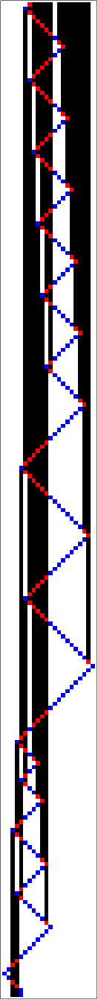
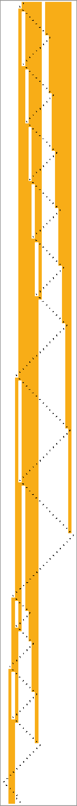
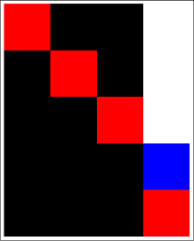
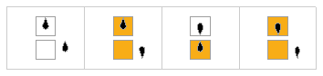
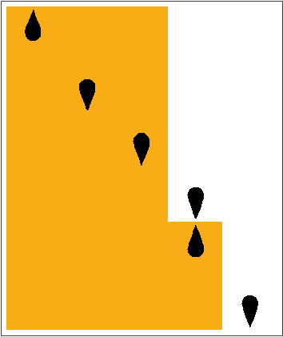
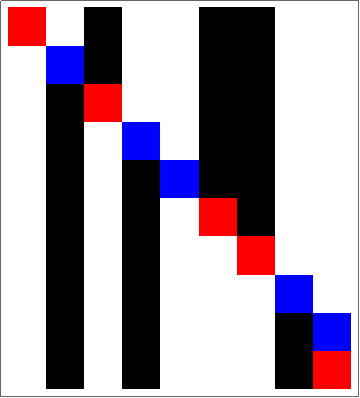
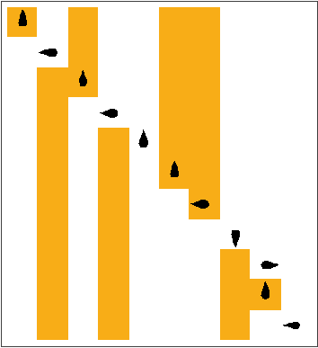
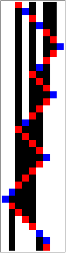
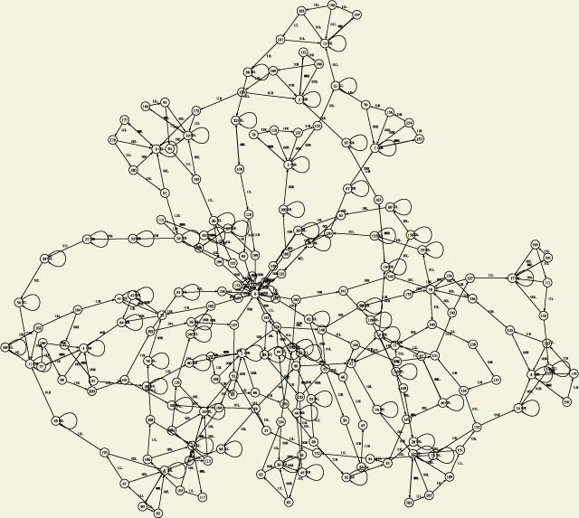
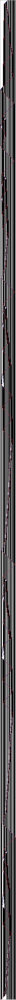

# ペンローズ『皇帝の新しい心』の万能テューリング機械


[ペンローズ『皇帝の新しい心』（みすず書房, 1994）](http://www.amazon.co.jp/exec/obidos/ASIN/4622040964/inquisitor-22/)（以下ENM）の万能テューリング機械（のための万能テューリング機械）をMathematicaで実装した。これは自己完結的な説明ではない。適宜ENMを参照してほしい。

用語：テューリングマシン, universal turing machine, ペンローズ, テューリング, 万能テューリングマシン

## hello, world

6と8の最大公約数をEUC（ユークリッドの互除法）で求める。

```
ToExpression[Import["https://raw.githubusercontent.com/taroyabuki/penrose_utm/master/utm.m", "Text"]];
euc = 267556252842584231926905232066896095708779077170409889426;
rule = makeRule[decodeDecimal[euc]];
step = TuringMachine[rule];
initTape = {1, 1, 1, 1, 1, 1, 0, 1, 1, 1, 1, 1, 1, 1, 1};
init = {{0, 1, 0}, {initTape, 0}};
result = NestWhileList[step, init , stopQ, 2];
Last[result]
```

```
{{0, 5, -2}, {{0, 0, 1, 1, 0, 0, 0, 0, 0, 0, 0, 0, 0, 0, 0, 0, 0, 0, 0, 0, 0, 0}, 0}}
```

テープが遷移する様子を描く。

```
alignPlot[result]
```



Ver. 11の`RulePlot`を使う（状態を1から数えることになっている仕様に合わせる）。

```
init = {{1, 1, 0}, {initTape, 0}};
RulePlot[TuringMachine[toWolframRule[rule]], init, Length[result]]
```



## テープの書き方

EMMで採用されているテープの書き方は以下の3通り。

+ UN: 正の整数nとカンマをそれぞれn個の1と0で表す。例えば，「6,8」はUNでは111111011111111となる。
+ XN: 0, 1, カンマをそれぞれ0, 10, 110で表す。例えば「6,8,」は「110,1000,」であり，XNでは1010011010000110となる。
+ UTM用: マシンの記述とマシンへの入力を，111110を挟んでつなげる。例えば，UN+1（177642<sub>10</sub>=101011010111101010<sub>2</sub>）に111を入力するなら，101011010111101010111110111となる。

## テューリングマシンの準備

必要な作業は以下の通り。

1. 10進数によるTMの記述を2進数による記述に変換する。（`IntegerDigits`）
1. 2進数によるTMの記述を復号する。（`decodeBinary`）
1. ルールの列を変換テーブルに変換する。（`makeRuleTable`）

まず，省略されている先頭の`110`と末尾の`110`を付け加える。次に，`{0 → 0, 10 → 1, 110 → R, 1110 → L, 11110 → STOP}`のルールで符号化された2進数列を復号する（ENM p.60-61）。

```
$RecursionLimit = Infinity;

decodeDecimal[n_] :=
 Reap[decodeBinary[Join[{1, 1, 0}, IntegerDigits[n, 2], {1, 1, 0}]]][[2, 1]]

decodeBinary[{}] := {}
decodeBinary[{0, x___}] := (Sow[0]; decodeBinary[{x}])
decodeBinary[{1, 0, x___}] := (Sow[1]; decodeBinary[{x}])
decodeBinary[{1, 1, 0, x___}] := (Sow[R]; decodeBinary[{x}])
decodeBinary[{1, 1, 1, 0, x___}] := (Sow[L]; decodeBinary[{x}])
decodeBinary[{1, 1, 1, 1, 0, x___}] := (Sow[STOP]; decodeBinary[{x}])
```

例として，UN+1 (177642)を復号する。

```
decodeDecimal[177642]
```

```
{R, 1, 1, R, 1, STOP, 1, 1, R}
```

実装上の問題から（単に`Partition`を使いやすいから？），XN*2のようにルールの数が奇数だったら，`{R}`を補うことにする。これによってENMでは適切でなかった記述が適切なものになってしまうことはあり得るが，適切だったものの振る舞いは変わらない。たとえば7はENMでは「正しい仕様が与えられていない」が，ここでは与えられる（いずれにしても止まらない）。

```
toTriple[{x_}] := {0, 0, x}
toTriple[{1, x_}] := {0, 1, x}
toTriple[{x_, y_, z_}] := {x, y, z}
toTriple[x_] := Prepend[Take[x, -2], FromDigits[Drop[x, -2], 2]]

makeRuleTable[in_] :=
 Partition[
  Map[toTriple,
   With[{tmp = Split[in, And[# =!= R, # =!= L, # =!= STOP] &]},
    If[OddQ[Length[tmp]], Append[tmp, {R}], tmp]]],
  2]
```

例として，UN+1 (177642)を復号する。このようなテーブルの方が，後述の置き換えルールよりも速い。

```
makeRuleTable[decodeDecimal[177642]]
```

```
{{{0, 0, R}, {1, 1, R}}, {{0, 1, STOP}, {1, 1, R}}}
```

## テューリングマシンのエミュレーション

原理的には，つまり計算資源（記憶領域と計算時間）の制限を無視すれば，テューリングマシンは任意のコンピュータをエミュレートできる。しかしふつうは，コンピュータでテューリングマシンをエミュレートする。

ここでは，二つのエミュレート法を採用する。

+ エミュレータの実装
+ [`TuringMachine`](http://reference.wolfram.com/mathematica/ref/TuringMachine.ja.html)の利用

### エミュレータの実装

割愛（`utm.m`の`tm`を参照）。

### [`TuringMachine`](http://reference.wolfram.com/mathematica/ref/TuringMachine.ja.html)の利用

`TuringMachine`は`{状態, 記号}->{状態, 記号, 移動方向}`のリストを与えて使う。先に作ったTMの記述をこのようなルールに変換する。

```
makeRule[decodedList_] :=
 With[{in = Split[decodedList, And[# =!= R, # =!= L, # =!= STOP] &]},
   Table[QuotientRemainder[i - 1, 2] -> toTriple[in[[i]]],
    {i, 1, Length[in]}]
   ] /. {L -> -1, R -> 1, STOP -> 0}
```

例として，UN+1 (177642)のルールを作る。

```
rule = makeRule[decodeDecimal[177642]]
```

```
{{0, 0} -> {0, 0, 1}, {0, 1} -> {1, 1, 1}, {1, 0} -> {0, 1, 0}, {1, 1} -> {1, 1, 1}}
```

`TuringMachine`はTMの停止を検出するようにはなっていないため，「停止するまで動かす」ということができない。停止するまで動かすために，次の二つの方法を試す。

+ ヘッドが動いていないことを確かめる関数`stopQ`を用意し，`NestWhile`や`NestWhileList`を使ってエミューレートする。この方法の利点は，TMの仕様はそのままでよいことである。
+ 「STOP」になったらそれ以降はヘッドが動かないように，TMのルールを変更し，`FixedPoint`や`FixedPointList`を使ってエミューレートする。この方法の利点は，組み込み関数だけで話が完結することである。

第1の方法を試す。

```
stopQ[pre_, now_] := pre[[1, 3]] != now[[1, 3]]
```

マシンとテープを`{{状態, テープの記述上の位置, 初期位置からの距離}, {テープ, テープの初期記号}}`という形で記述する（記述方法は他にもあるが、出力されるのはこの形式だから、合わせておくと楽）。

```
init = {{0, 1, 0}, {{1, 1, 1}, 0}};
```

エミュレートする。

```
result = NestWhileList[TuringMachine[rule], init, stopQ, 2]
```

```
{{{0, 1, 0}, {{1, 1, 1}, 0}},
 {{1, 2, 1}, {{1, 1, 1}, 0}},
 {{1, 3, 2}, {{1, 1, 1}, 0}},
 {{1, 4, 3}, {{1, 1, 1, 0}, 0}},
 {{0, 4, 3}, {{1, 1, 1, 1}, 0}}}
```

この方法だと，ステップごとにテープの長さが変わっていくため，テープの時間変化を可視可しづらい。エミュレート後にテープを揃えてもいいが（`utm.m`の関数`align`），`TuringMachine[rule, init, ステップ数]`で，もう一度エミュレートするのが簡単である。（`alignPlot[result]`でもできるようにしてある。）

```
evolution = TuringMachine[rule, init, Length[result] - 1]
```

```
{{{0, 1, 0}, {1, 1, 1, 0}},
 {{1, 2, 1}, {1, 1, 1, 0}},
 {{1, 3, 2}, {1, 1, 1, 0}},
 {{1, 4, 3}, {1, 1, 1, 0}},
 {{0, 4, 3}, {1, 1, 1, 1}}}
```

`ArrayPlot[result2[[All, 2]]]`でもよいが，次のようにすればヘッドの位置もわかる（ヘッドのある位置のテープが1なら赤，0なら青）。

```
plot[evolution] := ArrayPlot[Map[
   MapAt[If[# == 1, Red, Blue] &, #[[2]], #[[1, 2]]] &,
   evolution]]

plot[evolution]
```



Ver. 11の`RulePlot`を使うと簡単だが、この関数では状態を1から数えることになっているため、ルール等の変更が必要である。

```
toWolframRule[rule_] := rule /. {{a_, b_} -> {a + 1, b}, {a_, b_, c_} -> {a + 1, b, c}}
RulePlot[TuringMachine[toWolframRule[rule]]]
```



```
init = {{1, 1, 0}, {initTape, 0}};
RulePlot[TuringMachine[toWolframRule[rule]], init, Length[result]]
```



第2の方法を試す。

TMのルールを次のように変更する。

```
maxState = Max[rule[[All, 2, 1]]];
stopState = maxState + 1;
rule3 = Join[
  rule /. (x_ -> {a_, b_, 0}) -> (x -> {stopState, b, 0}),
  {{stopState, 0} -> {stopState, 0, 0},
   {stopState, 1} -> {stopState, 1, 0}}]
```

```
{{0, 0} -> {0, 0, 1},
 {0, 1} -> {1, 1, 1},
 {1, 0} -> {2, 1, 0},
 {1, 1} -> {1, 1, 1},
 {2, 0} -> {2, 0, 0},
 {2, 1} -> {2, 1, 0}}
```

エミュレートして可視化する。

```
step3 = TuringMachine[rule3];

result3 = FixedPointList[step3, init]
```

```
{{{0, 1, 0}, {{1, 1, 1}, 0}},
 {{1, 2, 1}, {{1, 1, 1}, 0}},
 {{1, 3, 2}, {{1, 1, 1}, 0}},
 {{1, 4, 3}, {{1, 1, 1, 0}, 0}},
 {{2, 4, 3}, {{1, 1, 1, 1}, 0}},
 {{2, 4, 3}, {{1, 1, 1, 1}, 0}}}
```

```
plot[TuringMachine[rule3, init, Length[result3] - 2]]
```

先と同じ結果になる。（割愛）

## 例（ENM p.61）

以上のように，EMMのテューリングマシンをエミュレートする方法はいろいろあるが，以下では`TuringMachine`と`stopQ`を使う方法だけを試す。

TMの番号と初期テープを与えると，停止するまでの計算過程を返す`tmTest`を作っておく。

```
tmTest[n_, initTape] :=
 NestWhileList[
  TuringMachine[makeRule[decodeDecimal[n]]],
  {{0, 1, 0}, {initTape, 0}},
  stopQ,
  2]
```

### UN+1

UNで表現された入力に1を足す。例として，3+1を計算する。

```
un1 = 177642;
tape = {1, 1, 1};
result = tmTest[un1, tape];
Last[result]
```

```
{{0, 4, 3}, {{1, 1, 1, 1}, 0}}
```

結果はUNで1111，つまり4である。

```
Length[result]
```

```
5
```

ステップ数は5-1=4。

```
alignPlot[result]
```


```
rule = toWolframRule[makeRule[decodeDecimal[un1]]];
init = {{1, 1, 0}, {tape, 0}};
RulePlot[TuringMachine[rule], init, Length[result]]
```


### XN*2

XNで表現された入力を2倍する。例として，6*2を計算する。

```
xn2 = 10389728107;
tape = {1, 0, 1, 0, 0, 1, 1, 0};
result = tmTest[xn2, tape];
Last[result]
```

```
{{0, 9, 8}, {{0, 1, 0, 1, 0, 0, 0, 1, 1}, 0}}
```

結果はXNで010100011，つまり1100<sub>2</sub>=12<sub>10</sub>である。

```
Length[result]
```

```
10
```

ステップ数は10-1=9。

```
alignPlot[result]
```



```
rule = toWolframRule[makeRule[decodeDecimal[xn2]]];
AppendTo[rule, {4, 1} -> {1, 1, 0}];
init = {{1, 1, 0}, {tape, 0}};
RulePlot[TuringMachine[rule], init, Length[result]]
```




### UN*2

UNで表現された入力を2倍する。例として，6*2を計算する。

```
un2 = 1492923420919872026917547669;
tape = {1, 1, 1, 1, 1, 1};
result = tmTest[un2, tape];
Last[result]
```

```
{{0, 13, 12}, {{0, 1, 1, 1, 1, 1, 1, 1, 1, 1, 1, 1, 1}, 0}}
```

結果はUNで111111111111，つまり12<sub>10</sub>である。

```
Length[result]
```

```
86
```

ステップ数は86-1=85。

```
alignPlot[result]
```


```
rule = toWolframRule[makeRule[decodeDecimal[un2]]];
init = {{1, 1, 0}, {tape, 0}};
RulePlot[TuringMachine[rule], init, Length[result]]
```


### XN+1

XNで表現された入力に1を足す。例として，3+1を計算する。

```
xn1 = 450813704461563958982113775643437908;
tape = {1, 0, 1, 0, 1, 1, 0};
result = tmTest[xn1, tape];
Last[result]
```

```
{{0, 7, 4}, {{0, 1, 0, 0, 0, 1, 1, 0, 0}, 0}}
```

結果はXNで010001100，つまり100<sub>2</sub>=4<sub>10</sub>である。

```
Length[result]
```

```
36
```

ステップ数は36-1=35。

```
alignPlot[result]
```



```
rule = toWolframRule[makeRule[decodeDecimal[xn1]]];
init = {{1, 1, 0}, {tape, 0}};
RulePlot[TuringMachine[rule], init, Length[result]]
```


### EUC（ユークリッドの互除法）

UNで表現された二つの整数の最小公倍数を求める。例として，6と8の最小公倍数を求める。

```
euc = 267556252842584231926905232066896095708779077170409889426;
tape = {1, 1, 1, 1, 1, 1, 0, 1, 1, 1, 1, 1, 1, 1, 1, 0};
result = tmTest[euc, tape];
Last[result]
```

```
{{0, 5, -2}, {{0, 0, 1, 1, 0, 0, 0, 0, 0, 0, 0, 0, 0, 0, 0, 0, 0, 0, 0, 0, 0, 0}, 0}}
```

結果はUNで11，つまり2である。

```
Length[result]
```

```
236
```

ステップ数は236-1=235。

```
alignPlot[result]
```


```
rule = toWolframRule[makeRule[decodeDecimal[euc]]];
init = {{1, 1, 0}, {tape, 0}};
RulePlot[TuringMachine[rule], init, Length[result]]
```


## 万能テューリング機械

Mathematicaの関数`TuringMachine`は万能テューリング機械である。つまり，テューリング機械の記述を与えると，そのテューリング機械として振る舞う。

ここでは，万能テューリング機械である関数`TuringMachine`に，万能テューリング機械の記述を与える。

### 10進表現（ENM pp.65-66）

<a href="http://www.amazon.co.jp/exec/obidos/ASIN/4022574097/inquisitor-22/"></a><a href="http://www.amazon.co.jp/dp/4772695370?tag=inquisitor-22"></a>

<blockquote>私が計算したuの2進表現を10進形式に変換してくださったことで，デイヴィッド・ドイッチ氏にお礼を申し上げる（p.83）</blockquote>

こんなところで量子計算や<a href="http://www.amazon.co.jp/exec/obidos/ASIN/4022574097/inquisitor-22/">『世界の究極理論は存在するか』</a>，<a href="http://www.amazon.co.jp/dp/4772695370?tag=inquisitor-22">『無限の始まり』</a>のドイッチが出てくるのは驚きである。ここでは逆に次のように10進形式で与え（本から写せる），2進形式に変換する。

```
u=7244855335339317577198395039615711237952360672556559631108144796606505059404241090310483613632359365644443458382226883278767626556144692814117715017842551707554085657689753346356942478488597046934725739988582283827795294683460521061169835945938791885546326440925525505820555989451890716537414896033096753020431553625034984529832320651583047664142130708819329717234151056980262734686429921838172157333482823073453713421475059740345184372359593090640024321077342178851492760797597634415123079586396354492269159479654614711345700145048167337562172573464522731054482980784965126988788964569760906634204477989021914437932830019493570963921703904833270882596201301773727202718625919914428275437422351355675134084222299889374410534305471044368695876405178128019437530813870639942772823156425289237514565443899052780793241144826142357286193118332610656122755531810207511085337633806031082361675045635852164214869542347187426437544428790062485827091240422076538754264454133451748566291574299909502623009733738137724162172747723610206786854002893566085696822620141982486216989026091309402985706001743006700868967590344734174127874255812015493663938996905817738591654055356704092821332221631410978710814599786695997045096818419062994436560151454904880922084480034822492077304030431884298993931352668823496621019471619107014619685231928474820344958977095535611070275817487333272966789987984732840981907648512726310017401667873634776058572450369644348979920344899974556624029374876688397514044516657077500605138839916688140725455446652220507242623923792115253181625125363050931728631422004064571305275802307665183351995689139748137504926429605010013651980186945639498;
```

### 2進表現（ENM pp.83-85）

2進数に変換する。おそらくドイッチも同じように変換しただけだろう。

```
BaseForm[u,2]
```

```
10000000010111010011010001001010101101000110100010100000110101001101000101010010110100001101000101001010110100100111010010100100101110101000111010101001001010111010101001101000101000101011010000011010010000010101101000100111010010100001010111010010001110100101010000101110100101001101000010000111010100001110101000010010011101000101010110101001010110100000110101010010110100100100011010000000011010000001110101001010101011101000010011101001010101010101011101000010101011101000010100010111010001010011010010000101001101001010010011010010001011010100010111010010010101110100101000111010100101001001110101010100001101001010101011101010010001011010100001011010100010011010101010100010110100101010010010110101001001011101010100101011101010010100110101010000111010001001001010111010101001010111010101000001110101001000001101010101001011101010010101101000100100011101000000011101001010010101010111010010100100101011101000001010111010000100011101000001010100111010000101001110100000100010111010001000011101000010010100111010001000010110100010100101110100010100101101001000001011010001010100100110100010101010111010010000011101001001010101011101010101001101001000101011010010010010110100000001011010000010001101000001001011010000000001101001010001011101001010100011010010100101011010000010011101001010100101101001001110101000000101011101010000001101010100010101011010010101011010100001010111010100100101011101010001001011010100100001011101000000111010100100010110101001010011010101000101110101001010010111010101000001011101010100000101110100000011101010100001010111010010101011010101000010111010100010101011101010100100101110101010100001110101000000011101001001000011010010010001011010101010100111010000000010110100100001101010101010010111010010000110100100010101011101000010001110100010000111010000110100000001011010000010010111010101001010101101000100010010111010000010011101010100110100000101010110100001000011101001000010001110101010101010011101000010010011101000100100001110100001010010110100001010000111010101010101011101000100100110100010010011010100101001011101000100010101110100000001110100010010010111010011010010010000101101010101001101000101000101110100001101010000100010110101001101010100101001011010101001101001001010111010011010010000010110100010101010001110100100001010110100000010011010010001001011101001000011010100000100101110100100101001101001001010101101001101001001010010110100110100101000001011010010000011101010010011010101010000101110100101000010111010010101010111010100010010110100100111010010101000101110100010011101010000101101001001110100101010101011101001000111010010101010010111010010001110101000001010101110011010100000101101001001110101000000101110100101101010000010101101001010010111010100001001011101000011010100010000101101010011010100010001011010101010010111010100010100101101000101010101110100100001010110101000101110101001001010101110101010010010111010100011101010001110101001001001011101010001110101001010001011101010001011101010000100101110101000111010001010001011101001010010111010100101010010111010010101010101011010100001010101011010000100111010000101010101011101010100010101110101010001010111010000001110101010001001011101000000111010101001000101110101000000110101000010110100000011101001000000101110101000111010100100010101110101001101010101000101011010000011010101010010101011010000001001101010101001001110101001101010101001001011010100110100100100111010000011010101010100101011010100010011010001010010101011101000001101010101010100101101000100011101000101010101010110100010001110100001010111010001001000011101001101000000010011101000000100101110100010001010011101000000100101110100101010101001011010000101010101110100010010100101110100000100010111010101001011010001000100111010000010010101110100000010101011010000100011100111101000010000011101000010010011101000001010010111010000010100101101000010001010111010000100010011010001000011101011110100001001001011101000010010010111010000000101011101000010101000110100010010111010000100000111010000100111010001000001011101010100101101000100000101110100001010101011101000000101010111010001000010101110100010000101011101001000001110101001001001101000000101011101000100010010111010101000011101010010101101001010101000011010000010100110100000001110100000100100111010010110100100010100101101010100110100010100100101101010100110100010101000101100110101001001011101010100110100010101010101100110101000101010110011010010001010101011101000100011101001001010101010110100101001010001101001000000101110100000110101010010101010110100101010110100100010001011101000101010110101000001010110100010000011010010001010110100001001110101001010101010111010010110100100100010101100110100100100101010111010011010010010010101101001011010010010010010110100101101001001010001011001101001001010010101110100010101110100100101110011010010010101001011100110100101000101010111010001000111010000101001011010010100010111010010100010101101000100111010010100010010111010001001110100101001000101110011010010001000111010001001110100101001010101110011010010100000111001101010101010110100000001110100101010010101011101001000111010010101001010111001101000010100100110011010100000110100000001110100101010100101011100110101000100001101000000011101000100101010101110100010001110101010101010101011010000100111010010001001010111010010101000100110101000000010110100100111010100001010111010010000110101000000010110100100011101010010010111010000110101000010101011010100010111010100001010010111010100010111010100010101010111001101010001010110100001101010001001010
```

次が重要。

<blockquote>また，氏が次のことを確かめてくださったことにもお礼を申し上げなくてはならない。uのこの2進数値は確かに万能テューリング機械をもたらす。</blockquote>

「人間」が確かめたのである。

### 変換テーブル

変換テーブルを見てみる。

```
rule = makeRuleTable[decodeDecimal[u]]
```

```
{{{0, 0, R}, {128, 1, L}},
 {{1, 0, R}, {75, 1, R}},
 {{2, 0, R}, {152, 0, R}},
 {{3, 0, R}, {78, 1, R}},
 {{4, 0, R}, {77, 1, R}},
 {{5, 0, L}, {90, 1, L}},
 {{6, 0, L}, {117, 1, L}},
 {{7, 0, R}, {153, 1, R}},
 {{8, 0, R}, {161, 1, R}},
 {{9, 0, L}, {177, 1, L}},
 {{10, 0, L}, {184, 1, L}},
 {{11, 0, R}, {68, 0, L}},
 {{12, 0, L}, {197, 0, L}},
 {{19, 1, R}, {13, 1, R}},
 {{8, 0, R}, {14, 1, R}},
 {{42, 0, R}, {64, 0, R}},
 {{16, 0, L}, {55, 1, L}},
 {{17, 0, L}, {191, 1, L}},
 {{35, 1, L}, {140, 1, L}},
 {{19, 0, R}, {163, 0, R}},
 {{45, 0, R}, {20, 1, R}},
 {{12, 1, L}, {21, 1, L}},
 {{22, 0, L}, {109, 0, L}},
 {{60, 0, R}, {23, 1, L}},
 {{52, 1, R}, {24, 1, R}},
 {{25, 0, R}, {124, 1, R}},
 {{186, 1, R}, {26, 1, L}},
 {{29, 1, L}, {27, 0, R}},
 {{28, 0, L}, {149, 1, L}},
 {{29, 1, L}, {56, 0, L}},
 {{104, 0, R}, {30, 1, L}},
 {{13, 1, R}, {74, 0, L}},
 {{32, 0, L}, {183, 1, L}},
 {{181, 1, L}, {33, 1, L}},
 {{34, 0, L}, {135, 0, L}},
 {{35, 0, L}, {132, 1, L}},
 {{36, 0, L}, {139, 0, L}},
 {{72, 1, R}, {38, 1, L}},
 {{38, 1, R}, {80, 1, R}},
 {{157, 0, R}, {39, 1, L}},
 {{40, 0, L}, {87, 1, L}},
 {{15, 0, R}, {41, 1, R}},
 {{42, 1, R}, {64, 1, R}},
 {{66, 0, R}, {66, 1, R}},
 {{128, 0, R}, {44, 1, L}},
 {{46, 0, R}, {45, 1, R}},
 {{33, 0, L}, {46, 1, R}},
 {{5, 0, L}, {193, 1, L}},
 {{48, 0, R}, {115, 1, R}},
 {{11, 1, R}, {49, 1, L}},
 {{53, 1, L}, {50, 1, R}},
 {{104, 1, L}, {16, 0, L}},
 {{52, 1, R}, {27, 0, R}},
 {{28, 1, L}, {54, 1, L}},
 {{112, 1, L}, {112, 1, L}},
 {{16, 0, L}, {113, 1, L}},
 {{11, 1, R}, {56, 1, L}},
 {{51, 1, L}, {58, 1, L}},
 {{60, 0, L}, {96, 0, L}},
 {{84, 0, R}, {84, 1, R}},
 {{31, 0, L}, {128, 1, R}},
 {{20, 0, R}, {62, 1, L}},
 {{20, 0, R}, {83, 1, L}},
 {{34, 0, L}, {36, 0, L}},
 {{4, 0, R}, {64, 1, R}},
 {{66, 1, L}, {59, 1, R}},
 {{146, 1, L}, {33, 0, L}},
 {{7, 0, R}, {67, 1, R}},
 {{68, 0, L}, {162, 0, L}},
 {{63, 0, L}, {69, 0, L}},
 {{148, 0, L}, {70, 1, R}},
 {{140, 0, L}, {31, 1, L}},
 {{37, 0, R}, {37, 0, R}},
 {{54, 1, L}, {73, 1, L}},
 {{32, 0, L}, {74, 1, L}},
 {{1, 0, R}, {168, 1, R}},
 {{15, 0, R}, {76, 1, L}},
 {{4, 0, R}, {196, 1, R}},
 {{3, 0, R}, {118, 1, R}},
 {{7, 0, R}, {21, 1, L}},
 {{1, 0, R}, {80, 1, R}},
 {{158, 0, L}, {81, 1, R}},
 {{65, 0, R}, {82, 1, L}},
 {{20, 0, R}, {194, 1, L}},
 {{43, 0, R}, {43, 1, R}},
 {{1, 0, R}, {86, 1, R}},
 {{1, 0, R}, {176, 1, R}},
 {{40, 0, L}, {13, 0, R}},
 {{120, 1, L}, {88, 1, L}},
 {{23, 1, L}, {50, 1, R}},
 {{5, 0, L}, {92, 1, L}},
 {{9, 0, L}, {24, 1, R}},
 {{5, 0, L}, {47, 1, L}},
 {{10, 0, L}, {94, 1, L}},
 {{10, 0, L}, {195, 1, L}},
 {{0, 0, R}, {48, 1, R}},
 {{5, 0, L}, {96, 1, L}},
 {{2, 1, R}, {97, 1, R}},
 {{22, 1, L}, {98, 1, L}},
 {{4, 0, R}, {200, 1, R}},
 {{3, 0, R}, {100, 1, R}},
 {{30, 1, L}, {102, 1, R}},
 {{39, 1, L}, {81, 1, R}},
 {{12, 1, L}, {107, 1, L}},
 {{58, 1, L}, {6, 0, L}},
 {{6, 0, L}, {106, 1, L}},
 {{6, 0, L}, {108, 1, L}},
 {{12, 1, L}, {98, 1, L}},
 {{6, 0, L}, {76, 1, L}},
 {{22, 1, L}, {110, 1, L}},
 {{95, 1, R}, {199, 1, R}},
 {{17, 0, L}, {143, 1, L}},
 {{57, 1, L}, {57, 1, L}},
 {{16, 0, L}, {114, 1, L}},
 {{16, 0, L}, {116, 1, L}},
 {{48, 0, R}, {24, 1, R}},
 {{16, 0, L}, {160, 1, L}},
 {{6, 0, L}, {105, 1, L}},
 {{3, 0, R}, {121, 1, R}},
 {{8, 0, R}, {123, 1, R}},
 {{65, 0, R}, {61, 0, L}},
 {{3, 0, R}, {122, 1, R}},
 {{3, 0, R}, {21, 0, L}},
 {{8, 0, R}, {125, 1, R}},
 {{25, 0, R}, {155, 1, L}},
 {{8, 0, R}, {126, 1, R}},
 {{18, 0, L}, {159, 1, R}},
 {{18, 0, L}, {17, 1, L}},
 {{148, 0, L}, {1, 0, R}},
 {{129, 0, L}, {130, 1, L}},
 {{147, 0, L}, {130, 1, L}},
 {{190, 1, R}, {71, 1, L}},
 {{150, 1, L}, {132, 1, L}},
 {{14, 1, R}, {73, 0, L}},
 {{133, 1, L}, {131, 1, R}},
 {{34, 0, L}, {0, 0, STOP}},
 {{136, 0, L}, {69, 0, L}},
 {{134, 1, L}, {134, 1, R}},
 {{137, 1, L}, {137, 0, R}},
 {{36, 0, L}, {0, 1, STOP}},
 {{138, 1, L}, {138, 1, L}},
 {{129, 1, L}, {142, 0, R}},
 {{18, 1, L}, {136, 0, L}},
 {{17, 0, L}, {144, 1, L}},
 {{14, 1, R}, {144, 1, L}},
 {{71, 1, L}, {131, 1, L}},
 {{145, 1, L}, {145, 1, L}},
 {{40, 0, L}, {53, 0, R}},
 {{65, 1, L}, {146, 1, L}},
 {{28, 0, L}, {13, 1, R}},
 {{188, 0, R}, {67, 0, R}},
 {{32, 0, L}, {133, 0, L}},
 {{2, 1, R}, {166, 1, R}},
 {{7, 0, R}, {154, 1, R}},
 {{7, 0, R}, {156, 1, R}},
 {{0, 0, R}, {26, 1, L}},
 {{7, 0, R}, {79, 1, R}},
 {{0, 0, R}, {51, 1, R}},
 {{0, 0, R}, {167, 1, L}},
 {{18, 0, L}, {175, 1, R}},
 {{182, 0, R}, {160, 1, L}},
 {{8, 0, R}, {119, 1, R}},
 {{11, 1, R}, {164, 1, L}},
 {{19, 1, R}, {97, 1, R}},
 {{72, 0, R}, {41, 1, R}},
 {{17, 0, L}, {111, 1, L}},
 {{2, 1, R}, {169, 1, R}},
 {{0, 0, R}, {171, 1, L}},
 {{1, 0, R}, {85, 1, R}},
 {{2, 1, R}, {170, 1, R}},
 {{2, 1, R}, {172, 1, R}},
 {{0, 0, R}, {173, 1, L}},
 {{9, 1, L}, {10, 1, L}},
 {{0, 0, R}, {174, 1, L}},
 {{0, 0, R}, {179, 1, L}},
 {{18, 0, L}, {70, 1, R}},
 {{44, 1, L}, {89, 1, R}},
 {{9, 0, L}, {178, 1, L}},
 {{9, 0, L}, {180, 1, L}},
 {{0, 0, R}, {82, 0, L}},
 {{9, 0, L}, {91, 1, L}},
 {{0, 0, R}, {88, 0, L}},
 {{0, 0, R}, {15, 1, R}},
 {{32, 0, L}, {187, 1, L}},
 {{10, 0, L}, {93, 1, L}},
 {{0, 0, R}, {141, 0, R}},
 {{0, 0, R}, {24, 0, R}},
 {{32, 0, L}, {189, 1, L}},
 {{0, 0, R}, {100, 0, R}},
 {{32, 0, L}, {151, 1, L}},
 {{18, 0, L}, {127, 1, R}},
 {{17, 0, L}, {165, 1, L}},
 {{185, 0, R}, {192, 1, R}},
 {{5, 0, L}, {49, 1, L}},
 {{20, 0, R}, {192, 1, R}},
 {{10, 0, L}, {26, 1, L}},
 {{4, 0, R}, {99, 1, R}},
 {{12, 1, L}, {198, 1, L}},
 {{12, 1, L}, {103, 1, L}},
 {{0, 0, R}, {25, 1, R}},
 {{4, 0, R}, {101, 1, R}}}
```

状態数は，

```
Length[rule]
```

```
201
```

下はこの万能テューリング機械の状態遷移図である。

<a href='utm_graphviz.pdf'></a>

### 動作例

#### UN+1

万能テューリング機械に，UN+1と3を入力し，UN+1に3を与えた場合，つまり3+1を計算させる。

```
machine = IntegerDigits[un1, 2];
delimiter = {1, 1, 1, 1, 1, 0};
input = {1, 1, 1};
initTape = Join[machine, delimiter, input];

result = tmTest[u, initTape];
Last[result]
```

```
{{0, 5, -20}, {{0, 1, 1, 1, 1, 0, 0, 0, 0, 0, 0, 0, 0, 0, 0, 0, 0, 0, 0, 0, 0, 1, 0, 1, 1, 0, 1, 0, 1, 0, 1, 1, 0, 1, 0, 1, 1, 1, 1, 0, 1, 0, 1, 0, 1, 1, 0, 1, 1, 1, 1, 1}, 0}}
```

ペンローズのTMは，マシンが停止したときにヘッドの左側にあるテープを出力と見なす仕様になっている。今，停止したときのヘッドの位置は5，それより左にあるテープはUNで01111，つまり4がマシンの出力である。

```
Length[result] - 1
```

```
3301
```

ふつうにやったときは4だったステップ数は3301になる。

```
alignPlot[result]
```




#### XN*2

万能テューリング機械に，XN*2と6を入力し，XN*2に6を与えた場合，つまり6*2を計算させる。

```
machine = IntegerDigits[xn2, 2];
delimiter = {1, 1, 1, 1, 1, 0};
input = {1, 0, 1, 0, 0, 1, 1, 0};
initTape = Join[machine, delimiter, input];

result = tmTest[u, initTape];
Last[result]
```

```
{{0, 10, -18}, {{0, 0, 1, 0, 1, 0, 0, 0, 1, 1, 0, 0, 0, 0, 0, 0, 0, 0, 0, 0, 0, 0, 0, 0, 0, 0, 0, 0, 0, 1, 0, 1, 1, 0, 1, 0, 0, 1, 1, 0, 1, 0, 1, 1, 0, 1, 0, 0, 0, 1, 1, 0, 1, 0, 1, 0, 1, 0, 1, 1, 0, 1, 1, 0, 1, 0, 1, 1, 1, 1, 0, 1, 1, 1, 1, 1}, 0}}
```

マシンの出力はXNで0010100011，つまり1100<sub>2</sub>=12<sub>10</sub>である。

```
Length[result] - 1
```

```
7517
```

ふつうにやったときは9だったステップ数は7517になる。


#### UN*2

万能テューリング機械に，UN*2と6を入力し，UN*2に6を与えた場合，つまり6*2を計算させる。

```
machine = IntegerDigits[un2, 2];
delimiter = {1, 1, 1, 1, 1, 0};
input = {1, 1, 1, 1, 1, 1};
initTape = Join[machine, delimiter, input];

result = tmTest[u, initTape];
Last[result]
```

```
{{0, 14, -19}, {{0, 0, 1, 1, 1, 1, 1, 1, 1, 1, 1, 1, 1, 1, 0, 0, 0, 0, 0, 0, 0, 0, 0, 0, 0, 0, 0, 0, 0, 0, 0, 0, 0, 0, 0, 0, 0, 0, 1, 0, 1, 1, 0, 1, 0, 0, 1, 1, 0, 1, 0, 0, 1, 0, 1, 1, 1, 0, 1, 0, 1, 0, 1, 1, 0, 1, 0, 1, 0, 0, 1, 1, 0, 1, 0, 0, 0, 0, 1, 1, 0, 1, 0, 1, 1, 1, 1, 0, 1, 0, 1, 0, 1, 0, 1, 1, 0, 1, 0, 0, 1, 0, 1, 0, 1, 1, 1, 0, 1, 0, 0, 0, 1, 0, 1, 1, 0, 1, 0, 0, 1, 0, 1, 1, 1, 0, 1, 0, 0, 1, 0, 1, 0, 1, 1, 1, 0, 1, 1, 1, 1, 1}, 0}}
```

マシンの出力はUNで00111111111111，つまり12である。

```
Length[result] - 1
```

```
294604
```

ふつうにやったときは85だったステップ数は294604になる。


#### XN+1

万能テューリング機械に，XN+1と3を入力し，XN+1に3を与えた場合，つまり3+1を計算させる。

```
machine = IntegerDigits[xn1, 2];
delimiter = {1, 1, 1, 1, 1, 0};
input = {1, 0, 1, 0, 1, 1, 0};
initTape = Join[machine, delimiter, input];

result = tmTest[u, initTape];
Last[result]
```

```
{{0, 7, -31}, {{0, 1, 0, 0, 0, 1, 1, 0, 0, 0, 0, 0, 0, 0, 0, 0, 0, 0, 0, 0, 0, 0, 0, 0, 0, 0, 0, 0, 0, 0, 0, 0, 0, 0, 0, 1, 0, 1, 1, 0, 1, 0, 1, 0, 1, 1, 0, 1, 1, 0, 1, 0, 0, 1, 0, 1, 1, 0, 1, 0, 1, 0, 0, 1, 1, 1, 0, 1, 0, 0, 1, 0, 1, 1, 0, 1, 0, 1, 1, 1, 1, 0, 1, 0, 0, 0, 0, 1, 1, 1, 0, 1, 0, 0, 1, 0, 1, 0, 1, 1, 1, 0, 1, 0, 0, 0, 1, 0, 1, 1, 1, 0, 1, 0, 1, 0, 0, 0, 1, 1, 0, 1, 0, 0, 1, 0, 1, 1, 0, 1, 1, 0, 1, 0, 1, 0, 1, 0, 1, 0, 1, 1, 0, 1, 0, 1, 0, 1, 0, 1, 1, 0, 1, 0, 1, 0, 1, 0, 0, 1, 1, 0, 1, 1, 1, 1, 1, 0, 0}, 0}}
```

マシンの出力はXNで0100011，つまり100<sub>2</sub>=4<sub>10</sub>である。

```
Length[result] - 1
```

```
109608
```

ふつうにやったときは35だったステップ数は109608になる。


#### EUC

万能テューリング機械に，EUCと「6と8」を入力し，EUCに「6と8」を与えた場合，つまり6と8の最大公約数を計算させる。

```
machine = IntegerDigits[euc, 2];
delimiter = {1, 1, 1, 1, 1, 0};
input = {1, 1, 1, 1, 1, 1, 0, 1, 1, 1, 1, 1, 1, 1, 1, 0};
initTape = Join[machine, delimiter, input];

result = tmTest[u, initTape];
Last[result]
```

```
{{0, 5, -43}, {{0, 0, 1, 1, 0, 0, 0, 0, 0, 0, 0, 0, 0, 0, 0, 0, 0, 0, 0, 0, 0, 0, 0, 0, 0, 0, 0, 0, 0, 0, 0, 0, 0, 0, 0, 0, 0, 0, 0, 1, 0, 1, 1, 0, 1, 0, 1, 0, 1, 1, 1, 0, 1, 0, 0, 1, 0, 1, 1, 0, 1, 0, 1, 0, 1, 1, 1, 0, 1, 0, 0, 1, 0, 0, 0, 1, 1, 0, 1, 0, 1, 0, 0, 1, 1, 0, 1, 0, 0, 0, 0, 1, 1, 0, 1, 0, 1, 0, 1, 0, 1, 1, 0, 1, 0, 0, 0, 0, 1, 1, 0, 1, 0, 0, 1, 0, 0, 1, 1, 0, 1, 0, 1, 0, 1, 0, 0, 1, 1, 1, 0, 1, 0, 1, 0, 0, 1, 0, 1, 1, 1, 0, 1, 0, 1, 0, 0, 0, 1, 1, 1, 0, 1, 0, 1, 0, 1, 1, 1, 0, 1, 0, 1, 0, 1, 0, 0, 1, 1, 1, 0, 1, 0, 0, 0, 0, 1, 0, 1, 1, 1, 0, 1, 0, 0, 0, 1, 0, 0, 1, 1, 1, 0, 1, 0, 0, 0, 0, 1, 0, 1, 1, 1, 0, 1, 0, 0, 0, 1, 1, 0, 1, 0, 1, 0, 1, 1, 1, 0, 1, 1, 1, 1, 0, 1, 0, 0, 1, 0, 0, 1, 0, 1, 1, 0, 1, 1, 1, 1, 1, 0, 0, 0, 0, 0, 0, 0, 0, 0, 0, 0, 0, 0, 0, 0, 0, 0}, 0}}
```

マシンの出力はUNで00110，つまり2である。

```
Length[result] - 1
```

```
1052980
```

ふつうにやったときは235だったステップ数は1052980になる。


## おまけ

次のようにシステムを構成することはできるだろうか。

<ul>
  <li>万能テューリング機械tm</li>
  <li>tmへの入力：
    <ul>
      <li>万能テューリング機械A</li>
      <li>Aへの入力：
        <ul>
          <li>万能テューリング機械B</li>
          <li>Bへの入力：
            <ul>
              <li>テューリング機械UN+1</li>
              <li>UN+1への入力：{1}</li>
            </ul>
          </li>
        </ul>
      </li>
    </ul>
  </li>
</ul>

つまり，以下を実行できるだろうか。

```
machineA = IntegerDigits[u, 2];
delimiter = {1, 1, 1, 1, 1, 0};
machineB = IntegerDigits[un1, 2];
inputA = Join[machineB, delimiter, {1}];
initTape = Join[machineA, delimiter, inputA];

result = tmTest[u, initTape];
```

ヒント：できるならステップ数は13億程度になるだろう。

C++でナイーブに実装し，手元のマシン（Core i5-6600, Visual Studi 2015）で時間を計ると表のようになった。このコードは，GCC 6.1やClang 3.8でもコンパイルできる（オプション`-std=c++14`が必要）。（テープの実装は，std::stringとstd::vector，std::listを試した。stringとvectorが速いのは，最初にreserveでメモリを確保しているためでもある。サイズをEUC(6, 8)に必要なテープの長さは6178である。）

<table>
<tr><th>計算</th><th>ステップ数</th><th>string</th><th>vector&lt;int></th><th>list&lt;int></th></tr>
<tr><td>UN+1(1)</td><td>1294673762</td><td>6.9s</td><td>3.2s</td><td>65s</td></tr>
<tr><td>UN*2(1)</td><td>7559780849</td><td></td><td>19s</td><td></td></tr>
<tr><td>XN*2(1)</td><td>4549996193</td><td></td><td>12s</td><td></td></tr>
<tr><td>XN+1(1)</td><td>45111627266</td><td>260s</td><td>120s</td><td></td></tr>
<tr><td>EUC(6, 8)</td><td>611931092371</td><td></td><td>1500s</td><td></td></tr>
</table>


## おまけ2

Mathematicaの関数`TuringMachine`には，ルールではなく，ルールをコード化した整数を与えることもできる。

整数からルールを作る方法は次のとおり。（ヘッドの移動は左右1ずつに限定。）

```
rulesOf[n_, states_, colors_] := Flatten[
  Table[
   With[{x = Quotient[n, (2 colors states)^(colors (states - s) + c)]},
    {s, c} -> {
      Mod[Quotient[x, 2 colors], states] + 1,
      Mod[Quotient[x, 2], colors],
      If[Mod[x, 2] == 0, -1, 1]}],
   {s, 1, states},
   {c, 0, colors - 1}],
  1]
```

```
In[2]:= x = RandomInteger[{0, 8^4 - 1}]

Out[2]= 1360

In[3]:= rulesOf[x, 2, 2]

Out[3]= {{1, 0} -> {2, 0, 1}, {1, 1} -> {1, 1, -1}, {2, 0} -> {1, 0, -1}, {2, 1} -> {1, 1, -1}}
```

ルールから整数を作る方法は次のとおり。（ヘッドの移動は左右1ずつに限定。）

```
numberOf[rules_, states_, colors_] :=
 Sum[Module[{s2, c2, d2},
   {s2, c2, d2} = {s, c} /. rules;
   ((2 colors) (s2 - 1) + 2 c2 +
      If[d2 == -1, 0, 1]) (2 colors states)^(colors (states - s) +
       c)] ,
  {s, 1, states},
  {c, 0, colors - 1}]
```

```
In[5]:= numberOf[rulesOf[x, 2, 2], 2, 2]

Out[5]= 1360
```

`TuringMachine`用の万能チューリング機械の記述は割愛する。

## おまけ3

Mathematicaだけでこういう話をするなら次のようになる。（式が整数にならないから対角線論法を使えないと思うかもしれない。詳細は割愛するが，その心配は無用である。）

```
Mathematicaで「1を足す機械」（関数）で「1というテープ」（引数）を処理する。

In[1]:= Function[{x}, x + 1][1]

Out[1]= 2

「1を足す機械」を記述する。

In[2]:= plus = Hold[Function[{x}, x + 1]]

Out[2]= Hold[Function[{x}, x + 1]]

同様に，「1というテープ」を記述する。

In[3]:= tape = Hold[1]

Out[3]= Hold[1]

「1を足す機械」で「1というテープ」を処理するというテープを記述する。

In[4]:= tape2 = plus[tape]

Out[4]= Hold[Function[{x}, x + 1]][Hold[1]]

これをReleaseHoldして結果を得る。つまり，ReleaseHoldは万能チューリング機械である。

In[5]:= ReleaseHold[tape2]

Out[5]= 2

万能チューリング機械を記述する。

In[6]:= utm = Hold[ReleaseHold]

Out[6]= Hold[ReleaseHold]

「万能チューリング機械で先のテープを読む」というテープを記述する。

In[7]:= tape3 = utm[tape2]

Out[7]= Hold[ReleaseHold][Hold[Function[{x}, x + 1]][Hold[1]]]

万能チューリング機械でこのテープを読む。

In[8]:= ReleaseHold[tape3]

Out[8]= 2

「万能チューリング機械で先のテープを読む」というテープを記述する。

In[9]:= tape4 = utm[tape3]

Out[9]= Hold[ReleaseHold][Hold[ReleaseHold][Hold[Function[{x}, x + 1]][Hold[1]]]]

万能チューリング機械でこのテープを読む。

In[10]:= ReleaseHold[tape4]

Out[10]= 2

まとめ

In[11]:= ReleaseHold[
 Hold[ReleaseHold][Hold[ReleaseHold][Hold[Function[{x}, x + 1]][Hold[1]]]]]

Out[11]= 2
```

Lispならこんな感じか。

```lisp
(EVAL '((LAMBDA (X) (EVAL X)) '((LAMBDA (X) (EVAL X)) '((LAMBDA (X) (+ X 1)) '1))))
```
